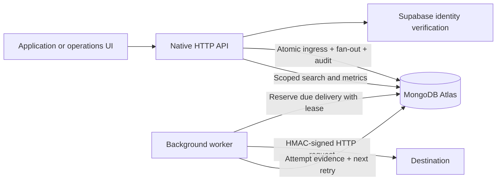

# Relay

A production-inspired webhook delivery platform: accept an event, commit its fan-out, and recover deliveries without repeating the original business action.

Node.js native HTTP • MongoDB replica set / Atlas • Supabase Auth • vanilla HTML/CSS/JavaScript

## Architecture



The API and worker can run together for development. For separate processes, set `RELAY_WORKER_ENABLED=false` on the API and run `npm run worker` with the same MongoDB database and encryption key. Workers do not serve HTTP or need a Supabase service-role credential.

## Reliability slice: durable queue, idempotency and route policies

Ingress returns **202 after a MongoDB transaction commits**, rather than holding the request open for outbound retries. The transaction writes the ingress receipt, every delivery, and its audit record. A unique workspace/idempotency-key index resolves concurrent duplicates. Reusing a key with different content returns 409. Keys are retained with ingress receipts; there is no automatic expiry.

Workers atomically reserve work with a compare-and-set operation and a 60-second lease. Retry deadlines and attempt history live in MongoDB. A replacement worker can recover an expired lease. Completion is fenced by the lease token, so a stale worker cannot overwrite its replacement. Retry policies support 1–10 attempts, fixed/exponential backoff, a base delay and a 100–30,000 ms timeout. Retries use a policy snapshot; replay uses the current route policy and retains history. Pausing a route stops new matching and future attempts; an already-started request can finish.

Delivery is **at least once**. A receiver may accept a request immediately before a worker crashes; the recovery attempt can send it again. Receivers must deduplicate the stable `relay-event-id`. A crashed reservation consumes an attempt budget, since Relay cannot prove whether it reached the receiver. No exactly-once claim is made.

### Why a MongoDB queue?

Relay already uses MongoDB. Keeping the durable queue and ingress receipt in the same transactional database avoids a database-to-broker dual-write gap and an additional hosted service. This fits a modest portfolio workload on an existing Atlas replica set.

- **QStash:** managed HTTP scheduling reduces worker operations, but introduces another service, public callback authentication, and reconciliation between accepted database events and published messages. Its free allowance and attempt-based billing should be checked before adopting it: [QStash pricing](https://upstash.com/pricing/qstash).
- **BullMQ + Redis:** a strong dedicated queue with richer scheduling and concurrency facilities; adds Redis persistence, connections and another datastore to operate. See [BullMQ connections](https://docs.bullmq.io/guide/connections).
- **Chosen trade-off:** polling consumes MongoDB operations and database capacity. A sleeping Render free web service pauses its embedded worker; queued work survives, but retries run late until the process wakes. This is durable storage, not a free always-on delivery SLA. At greater volume, introduce a broker plus a transactional outbox, and run workers separately.

MongoDB's [atomic compound operations](https://www.mongodb.com/docs/drivers/node/current/crud/compound-operations/) underpin work reservation. Transactions require a replica set; standalone MongoDB is rejected. There is no silent in-memory fallback.

## Workspace and authentication slice

Supabase is the identity provider; MongoDB owns users, workspaces, memberships, routes and deliveries. Relay validates access tokens with Supabase's `/auth/v1/user` endpoint, not by trusting decoded JWT claims. Browser access/refresh tokens use HttpOnly, SameSite cookies. API clients can send a Supabase bearer access token.

Every signed-in user gets a personal workspace. Owners configure routes and membership; operators ingest and replay; viewers are read-only. All delivery, route, search, metrics and audit queries are scoped to an authorized workspace. Use `X-Workspace-Id` to select it. Existing Supabase users sign in with email/password; account registration, password recovery and provider configuration remain in Supabase.

Reference: [Supabase token verification](https://supabase.com/docs/guides/auth/jwts).

## Run locally

Node.js 20 or newer. Install dependencies with `npm install`.

For an Atlas-backed development demo, configure `MONGODB_URI` in `.env`, then use `npm run demo` and open http://localhost:3100. It uses the separate `relay_demo` database on that same cluster, with real loopback webhook receivers. There is no local MongoDB download or in-memory fallback. The demo encryption key lives in ignored `.relay-local/master-key`; retain it to read its saved route credentials. Authentication is explicitly local-only, and both demo servers bind to loopback. Send `payment.created` for fan-out and recovery, or `incident.created` to exercise dead-letter handling. Supabase is not contacted in demo mode.

For your own existing services, copy `.env.example` to `.env`, supply the required settings privately, then run `npm start`. This repository never provisions accounts or deploys automatically on your behalf.

Required settings:

- `MONGODB_URI`: existing replica-set connection string.
- `MONGODB_DB`: database name.
- `RELAY_ENCRYPTION_KEY`: base64-encoded 32-byte master key. Supply through your secret manager and retain it across restarts.
- `SUPABASE_URL` and `SUPABASE_PUBLISHABLE_KEY`: existing project's URL and publishable key. A service-role key is neither needed nor accepted.
- `RELAY_PUBLIC_ORIGIN`: exact browser origin for same-origin checks.
- `RELAY_AUTH_MODE=supabase`. Local mode is forbidden in production.

Do not replace the encryption key casually: it is required to decrypt existing route credentials. This version does not implement multi-key master-key migration.

## Operational interface

The interface opens on the delivery ledger, with a compact summary and adjacent inspector. Routes and activity have separate views; event submission opens in a dialog. Muted colors, table rows, plain labels and restrained typography keep the emphasis on operating the service.

- **Dispatch:** preview matching destinations; supply an idempotency key and optional correlation ID; receive a persisted queue receipt.
- **Route detail:** edit maximum attempts, fixed/exponential backoff, delay, timeout and enabled/paused state; inspect recent attempt history and receiver verification guidance.
- **Delivery ledger:** combine event-type substring, destination, outcome, creation-date range and exact correlation ID filters. Results are paged in batches of 50. Correlation IDs in the inspector link back to search; use **Copy correlation ID** to paste an ID into logs or support notes. Clipboard access requires HTTPS or localhost and browser permission.
- **Observability:** terminal delivery success rate, p50/p95/p99 attempt latency, attempt success over time, categorized failures and all-time unresolved queue counts. Route health keeps older unresolved failures visible. Empty metrics show no data.
- **Audit:** latest 100 workspace actions, with actor, action, target and timestamp.
- **Access:** select or create workspaces; owners can add existing Relay users as operators or viewers. The UI supports desktop and mobile, keyboard focus and reduced motion.

Metrics default to deliveries accepted in the last 24 hours; the date filters can change this cohort. Attempt metrics include recorded outcomes within the selected window, excluding unfinished reservations. Terminal success excludes pending deliveries. A window exceeding 20,000 deliveries is rejected with a request to narrow the range; it is never silently sampled. Use database rollups for larger traffic volumes.

## Ingress contract

`POST /api/ingest`, with `Content-Type: application/json`, `Idempotency-Key`, authentication and optionally `X-Workspace-Id` / `X-Correlation-Id`.

Body:

```json
{
  "type": "payment.created",
  "correlationId": "checkout-example",
  "payload": { "payment_id": "pay_example", "amount": 3200, "currency": "USD" }
}
```

The response includes the ingress ID, correlation ID and independently tracked deliveries. Correlation is generated if omitted and stays the same across fan-out, retries and replay. The idempotency fingerprint uses canonical JSON and the caller-supplied correlation ID. Omitting correlation on a duplicate returns the original generated value.

Outbound headers: `relay-event-id`, `relay-ingress-id`, `relay-correlation-id`, `relay-event-type`, `relay-timestamp`, `relay-signature`.

The signature is `v1=<hex HMAC-SHA256>` over **timestamp + "." + the exact raw request body**. Verify with a constant-time comparison, enforce a timestamp tolerance (for example five minutes), and deduplicate the delivery ID after verification. Each attempt has a fresh timestamp/signature.

## Route secrets and security

To provision a receiver, set `RELAY_API_ORIGIN`, `RELAY_WORKSPACE_ID`, and an owner's `RELAY_ACCESS_TOKEN` privately in your shell, then run `node scripts/provision-secret.js <route-id> <absolute-private-file>`. The output file must be new and outside this repository. Configure your receiver from that file through its secret manager; never paste it into the UI or commit it. In the loopback-only demo, the access token is unnecessary. Rotation replaces the active credential immediately: pause the route, provision the credential, update the receiver, then resume.

Route secrets use AES-256-GCM with the route ID as authenticated context. The master key is supplied outside source control. Secrets are never returned in route responses or rendered in the UI. Use the provisioning CLI to generate a receiver credential in a private file and send it to Relay; it prints only success/failure. The route detail view explains this workflow.

Requests are limited to 100 KB. URLs must use HTTP(S), with no embedded credentials, query strings or fragments. DNS is checked on creation and every attempt, and the validated IP is pinned to the actual outbound connection. Redirects are not followed. Private, reserved, mapped and transition addresses are rejected by default. Local destination access is an explicit development-only option.

MongoDB-backed limits cover login, IP and authenticated workspace traffic across processes. Proxy headers are not trusted as client identity; deployments behind one proxy may share the coarse IP allowance. Errors and audits omit credentials, payloads and destination URLs. Audit records are append-only through the application API, not tamper-proof against database administrators.

## Storage compatibility

New functionality uses `relay_*` collections. Legacy `events` and `endpoints` are left untouched because they lack a safe workspace owner and may contain plaintext credentials. They are not silently assigned to the first person who signs in. Recreate or explicitly migrate routes into an owned workspace before retiring the legacy data.

## API surface

| Method | Path | Purpose |
| --- | --- | --- |
| GET | /api/session | Verified identity and accessible workspaces |
| POST | /api/auth/login, /refresh, /logout | Browser session lifecycle (under /api/auth) |
| POST | /api/workspaces | Create an owned workspace |
| GET / POST | /api/members | Owner-managed membership |
| POST | /api/ingest | Atomic route fan-out |
| GET / POST | /api/events | Search deliveries / queue one destination |
| GET | /api/events/:id | Delivery evidence |
| POST | /api/events/:id/replay | Queue a recovery cycle |
| POST | /api/endpoints | Create a route |
| GET / PATCH | /api/endpoints/:id | Route health, attempts and configuration |
| POST | /api/endpoints/:id/rotate-secret | Provision a receiver credential |
| GET | /api/dashboard | Stored delivery metrics and queue counts |
| GET | /api/audit | Recent workspace audit records |
| GET | /api/health | Database and worker status |

## Verification

Run `npm test` using your configured Atlas connection. Each test creates a randomly named `relay_test_<uuid>` database on that cluster and drops only that test database afterward. The configured app database is never used for test fixtures. Tests require permission to create and remove these temporary databases. No MongoDB binary is downloaded. Supabase's HTTP contract is exercised with a local auth test server; live provider verification requires configuring an existing project.

The backend suite exercises concurrent idempotency, real signed HTTP requests, timeout/retry/dead-letter/replay, forced worker-process termination and lease recovery, multi-worker exclusion, workspace/role isolation, Supabase session/refresh behavior, direct delivery, filtering, real metrics, encrypted secrets, SSRF restrictions, redirects, body limits and shared rate limits.

`npm run test:ui` drives the full interface at desktop and mobile sizes, checks duplicate prevention, route editing, filters, literal rendering of hostile text and horizontal overflow. It uses Edge on Windows by default; set `RELAY_BROWSER_CHANNEL` for another installed Playwright-supported channel. Browser tests also use temporary `relay_ui_<uuid>` databases on the configured Atlas cluster and remove them afterward.

Live Supabase provider verification still requires your existing Supabase URL/publishable key and an existing user. Tests use a local HTTP authentication fixture; they do not create or change external accounts.

## Deployment configuration and operating limits

`render.yaml` is configuration only; it has not been applied. It declares required environment variables without values, enables production safeguards, and disables service auto-deploys. See the [Render Blueprint reference](https://render.com/docs/blueprint-spec) before applying it yourself. Existing Blueprint auto-sync settings are separate and are not changed by this repository.

- Keep the encryption key backed up separately from the database. Losing it makes stored route credentials unusable.
- A free sleeping web service does not provide continuous retry execution. Use an always-running worker when delivery timing matters.
- Queue delivery remains at least once. A crash near the send/commit boundary can produce a duplicate or an indeterminate attempt. A recovery reservation after the send budget is exhausted records a terminal lease-expiry outcome without another outbound request.
- Retry policy snapshots remain fixed for an existing cycle; the current route URL and active signing credential are used on each attempt. Replay starts a new cycle with the current policy.
- Workspace route count is capped at 50 and replay cycles at 20 to keep fan-out and evidence records bounded. Retention, archival, key-ring migration, machine API credentials and alert integrations are future work.
- Authentication is fail-closed in production. Local development mode binds only to loopback and is rejected with `NODE_ENV=production`.

## Project structure

```text
server-v2.js          API process and embedded-worker startup
worker.js             Standalone worker entry point
storage.js            Transactions, leases, scoped queries and audit storage
delivery.js           DNS-pinned transport, signing and background retries
lib/app.js            HTTP routes, authorization and request controls
lib/auth.js           Supabase verification and browser session lifecycle
lib/security.js       Validation, encryption and destination restrictions
lib/metrics.js        Stored-event metric calculations
public/relay.*        Responsive operations interface
scripts/demo.js       Atlas-backed loopback demo and real test receivers
scripts/provision-secret.js  Private receiver credential provisioning
tests/                Backend and browser end-to-end coverage
```

